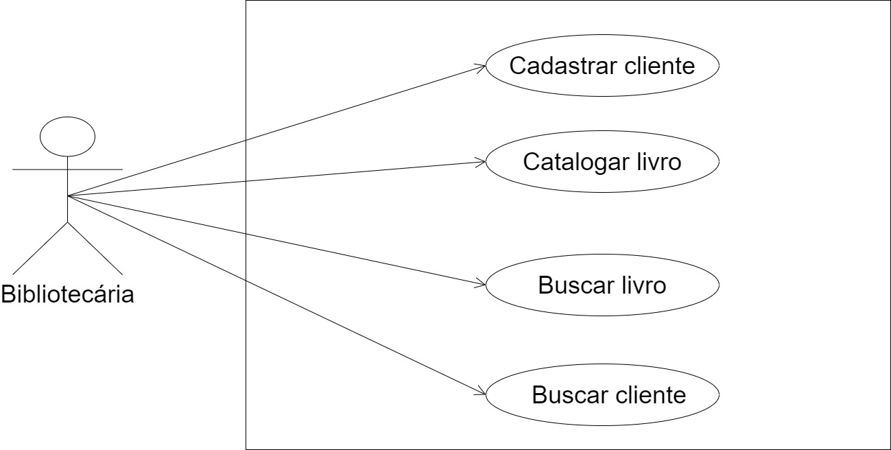

# Engenheiro de software

"We see three critical differences between programming and software engineering: time, scale, and the trade-offs at play. On a software engineering project, engineers need to be more concerned with the passage of time and the eventual need for change. In a software engineering organization, we need to be more concerned about scale and efficiency, both for the software we produce as well as for the organization that is producing it. Finally, as software engineers, we are asked to make more complex decisions with higher-stakes outcomes, often based on imprecise estimates of time and growth. Within Google, we sometimes say, “Software engineering is programming integrated over time.” Programming is certainly a significant part of software engineering: after all, programming is how you generate new software in the first place. If you accept this distinction, it also becomes clear that we might need to delineate between programming tasks (development) and software engineering tasks (development, modification, maintenance). The addition of time adds an important new dimension to programming. Cubes aren’t squares, distance isn’t velocity. Software engineering isn’t programming."

Titus Winters, Software Engineering at Google

## Comentário

Através do texto se nota a necessidade do engenheiro de software conhecer diversos tipos de ferramentas que se encontram a sua disposição. Preocupando-se com tempo, tanto para o desenvolvimento do projeto quanto para a efetividade do mesmo a longo prazo, é necessário se atentar aos seus aspectos essenciais como usabilidade, necessidade de manutenção e alteração.

 

# Trade-off

O trade off está relacionado a tomada de decisões. Quando existem dois recursos semelhantes para uma determinada tarefa, mas apenas um deles é escolhido para ser utilizado.

 

# Ciclo de Vida do Desenvolvimento de Software

### Situação:
Uma bibliotecaria deseja fazer o cadastro de clientes que alugam os livros da biblioteca, bem como catalogar os livros em um sistema para poder separá-los em categorias e saber quais livros foram alugados e quais estão disponíveis.

#### Requisitos funcionais:
• Cadastrar clientes: Cadastrar nome, número de contato, livros alugados e prazo de devolução. • Catalogar livros: Separar por nome, gênero e informar se o livro está disponível ou não.

### Requisitos não funcionais:
• Fácil acesso por parte do administrador.  
• Clareza  
• Confiabilidade

 

# Diagrama de Casos de Uso

